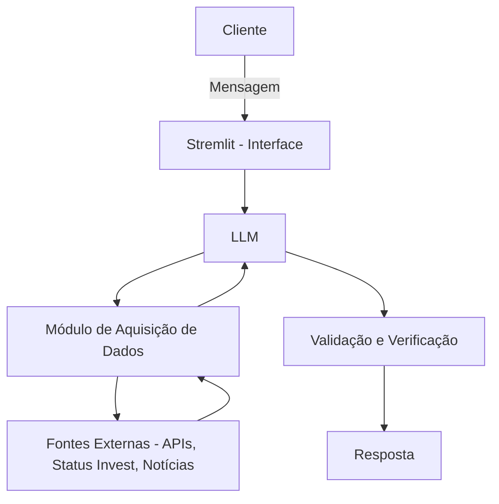

# Documentação do Agente

## Caso de Uso

### Problema
> Qual problema financeiro seu agente resolve?

Investidores, especialmente iniciantes, têm dificuldade em analisar ações de forma completa e confiável, considerando múltiplos fatores como indicadores financeiros, contexto macroeconômico e eventos globais. Além disso, há excesso de informações dispersas e risco de decisões baseadas em dados incompletos ou desatualizados.

### Solução
> Como o agente resolve esse problema de forma proativa?

O agente realiza análises automatizadas de ações com base em dados atualizados de fontes confiáveis, como Status Invest, além de considerar fatores macroeconômicos e geopolíticos. Ele avalia indicadores como dividend yield e potencial de crescimento, gerando recomendações de buy, sell ou hold.
O sistema prioriza transparência, evitando alucinações e informando explicitamente quando dados essenciais estiverem ausentes ou insuficientes.

### Público-Alvo
> Quem vai usar esse agente?

•Investidores iniciantes que precisam de orientação\
•Investidores intermediários que buscam otimizar análises\
•Usuários interessados em decisões baseadas em dados atualizados\
•Pessoas que desejam suporte automatizado para gestão de carteira

---

## Persona e Tom de Voz

### Nome do Agente
QuantIA

### Personalidade
> Como o agente se comporta? (ex: consultivo, direto, educativo)

Consultivo, analítico e objetivo. O agente prioriza precisão e transparência, evitando especulações. Atua como um assessor financeiro técnico, explicando suas decisões com base em dados e deixando claras quaisquer limitações.

### Tom de Comunicação
> Formal, informal, técnico, acessível?

Técnico e acessível, com linguagem clara e direta. Evita termos desnecessariamente complexos, mas mantém rigor analítico nas explicações.

### Exemplos de Linguagem
- Saudação: [ex: ""Olá. Informe o ativo que deseja analisar.""]
- Confirmação: [ex: "Entendido. Iniciando análise com base em dados recentes e contexto de mercado."]
- Erro/Limitação: [ex: "Não há dados suficientes ou atualizados para uma análise confiável no momento. Recomenda-se cautela."]

---

## Arquitetura

### Diagrama

### Componentes

| Componente | Descrição |
|------------|-----------|
| Interface | [Streamlit](https://streamlit.io/) |
| LLM | Ollama (Local) |
| Aquisição de Dados | Coleta dinâmica de informações via APIs, Status Invest e fontes externas |
| Processamento | Análise de indicadores (dividend yield, crescimento, contexto macroeconômico) |
| Validação | Checagem de alucinações e filtragem das informações por confiabilidade |

---

## Segurança e Anti-Alucinação

### Estratégias Adotadas

- [x] Agente só responde com base nos dados fornecidos
- [x] Respostas incluem fonte da informação
- [x] Quando não sabe, admite e não realiza recomendação
- [x] Recomendações fundamentadas, com filtragem e baseadas em histórico

### Limitações Declaradas
> O que o agente NÃO faz?

•Não realiza previsões garantidas de mercado ou promessas de lucro\
•Não substitui um assessor financeiro humano certificado\
•Não toma decisões automaticamente ou executa operações de compra/venda\
•Não fornece recomendações quando há falta de dados confiáveis ou atualizados\
•Não utiliza informações não verificadas ou com menos de três meses sem sinalizar ao usuário\
•Não acessa informações privadas do usuário sem fornecimento explícito\
•Não cobre todos os ativos financeiros existentes, estando limitado às fontes integradas\
•Não reage em tempo real a eventos instantâneos (latência de coleta e análise de dados)\
•Não elimina riscos de investimento, apenas auxilia na tomada de decisão\
•Não gera respostas especulativas ou sem fundamentação (alucinações são evitadas e sinalizadas)
